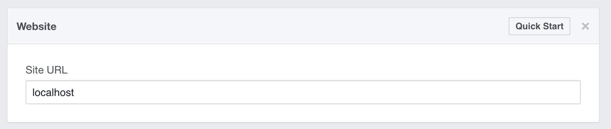
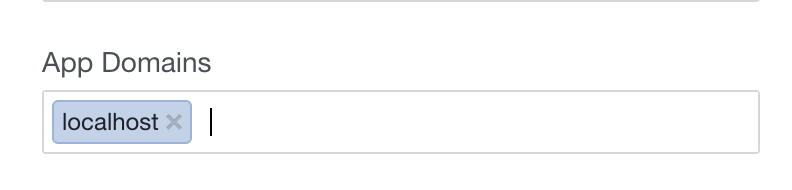
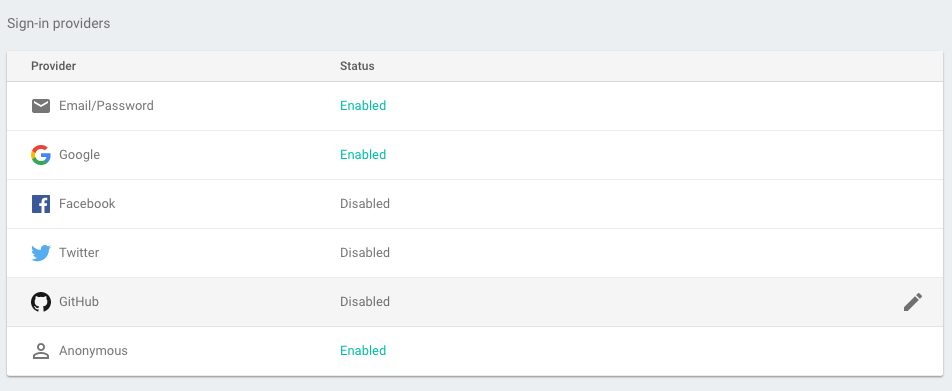
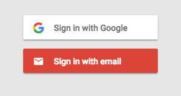

# Welcome to our Social Integration + Authentication workshop!


Today we are going to implement a webpage that a user has to sign into to access. Like a lot of webpages, we can use Google or Facebook accounts for authentication, sometimes without putting in your password. WOWIE! Below we have workshops for Facebook Login, Google Login and Firebase Authentication.

# Facebook

We'll be showing you guys how to add a Facebook login feature using a pretty simple node module...BUT

## First things first

You need to fork and clone this repo duhhhhh! Go ahead, you got this.


## Facebook Authentication


Well whattya know, there's a handy dandy npm module for implementing the facebook login with react. Let's install it!

```
$ npm install react react-dom react-facebook-login —save
```


Ok ok I'll take a break from the memes for a bit while we get this set up :)

Let’s start with our app file in the src/components directory. Currently you can see we have a basic structure there.

```
import React, { Component } from 'react';

// example class based component (smart component)
class App extends Component {
  constructor(props) {
    super(props);

    this.state = {

    };

  }


  render() {
    return (
      <div id="login">
      </div>
    );
  }
}

export default App;

```

Now we need to import our react Facebook login at the top of our file.

```
import FacebookLogin from 'react-facebook-login';
```

What are we going to render? A login button right? Ok so here is the basic structure of the Facebook login element based off of the NPM documentation for that module. You want to put this nested inside the current login div.

```
<div id="facebook">
  <FacebookLogin
    appId="yourappid"
    autoLoad
    fields="name,email,picture"
    callback={someCallback}
  />
</div>
```

So it looks like we need an App ID.

Head over here to get your ID. https://developers.facebook.com/apps/

Register as a developer, it only takes a second :)


Make a new web app with the name of your choice and grab that App ID.

Now add it into the code where we specified in the FaceBookLogin component. What else do we need to do? We need to define our callback function, or what the website will return after the user is logged in. Facebook’s api is nice because it allows you to access some user information, so let’s use that to welcome the user when they log in!

First step is to name our login function. You can call it whatever you want, but we gave it the creative title onFacebookLogin. So inside the callback curly braces add the function name.

```
callback={this.onFacebookLogin}
```

Then, make sure to bind the function to this in your constructor (you should know how to do this by now).

And also you need to define your function:

```
onFacebookLogin(response) {
  if (response.status !== 'not_authorized' && response.status !== 'unknown'){

  } else {

  }
}
```

Here we already have a nice if-statement that checks whether the login was successful or not yay!

Now inside we want to greet the user. So we want to add to our html when logged in. Here’s an example of what you could say!

```
document.getElementById('facebook').innerHTML = `Welcome, ${response.name}! `;
document.getElementById('facebook').innerHTML += ``;
document.getElementById('facebook').style = 'display: block';
```

And if they weren’t logged in you would want to still call to display block because it caches the login. So add this under the else statement.

```
document.getElementById('facebook').style = 'display: block';
```

The picture seems kinda small too so let’s change the fields attribute in our Facebook element to:

```
fields="name,email,picture.type(large)"
```

There's one last thing we need to do on Facebook before we can test our new page.

Head back over to https://developers.facebook.com/apps/ and click on the app you made

In settings, click add platform


and select website. Then, set the Site URL field to http://localhost/



Lastly, we need to add localhost to the main settings section (towards the top of this page)



Make sure you click to save your settings.

There we go! Now we told facebook to allow the app to run on our localhost!


We are ready to test it out! Gotta npm start it up!

```
$ npm start
```


Go to your localhost and try logging it and see what happens. Make sure to ask questions if you are having trouble, or retrace your steps in the tutorial.

Ok lets switch gears and add a google login for kicks as well!

# Google Authentication:


Just something to think about. :)

## Step one: Get the Client ID

We'll be being implementing a Google log-in feature as React component using a node-modeule.
But so before we start, we need to go create a Google Developers Console project and client ID.

First go to:
[google's API console](https://console.developers.google.com/project/_/apiui/apis/library)

and create a new project.

In the sidebar under "API Manager", select Credentials, then select the OAuth consent screen tab.
Choose an Email Address, specify a Product Name, and press Save.

In the Credentials tab, select the Create credentials drop-down list, and choose OAuth client ID.

Under Application type, select Web application.
Register the origins from which your app is allowed to access the Google APIs, as follows. An origin is a unique combination of protocol, hostname, and port.
In the Authorized JavaScript origins field, enter the origin for your app. You can enter multiple origins to allow for your app to run on different protocols, domains, or subdomains. You cannot use wildcards. In the example below, the second URL could be a production URL.

http://localhost:8080

https://myproductionurl.example.com

The Authorized redirect URI field does not require a value. Redirect URIs are not used with JavaScript APIs.

Press the Create button.

From the resulting OAuth client dialog box, make sure you write down the Client ID, you will use it soon!! The Client ID lets your app access enabled Google APIs.


Ok now we can add google sign in to our website! Yay!

## Step two: An Introduction to Google API JavaScript Client Library and Installing the Node-Module

Google provides developers with a Google API JavaScript Client Library chock full of functions that provides access to a majority of Google's APIs. You can check out the reference docs [here](https://developers.google.com/api-client-library/) if you're interested in. NOTE: to use methods from the client library in a React component you need to add the prefix `window.gapi...`.

Like Facebook Login we'll being making things a lot easier and streamline accessing the client with a node-module: react-google-login. You can find more information about it [here](https://github.com/anthonyjgrove/react-google-login). Install it with npm like you normally do:

```
$ npm install --save react-google-login
```

This module provides the code for a google login React component, SWEET!
We'll be adding the component into App so don't forget to import it:
```
import GoogleLogin from 'react-google-login';
```

Great Job!


## Step three: Add In Callback Function and Sign-In Button

To switch things up, we decided to use the App's state with google authentication and making a separate render function instead of using the document.getElementById functions. You could still do it the other way, but we wanted to show a couple different directions you could take.

We first need to establish the baseline state of the app in the constructor.

```
this.state = {
  google: false,
  googleName: '',
  googleEmail: '',
  googleImage: '',
}
```

The react-google-login module takes in a callback function as a prop and returns a GoogUser object to that callback as a response. You can read through the documentation on that [here](https://developers.google.com/api-client-library/javascript/reference/referencedocs#users). We're going to grab the profile of the user with the function: `response.getBasicProfile()`. From the BasicProfile object we can get name, email, and a profile picture using `getName()`, `getEmail()`, and `getImageUrl()`.

In this case we called the function `onGoogleLogin(response)` but you can call it whatever you like.

We also want update the component by calling `this.setState` in our response function.

Here's how we wrote it:

```
// What happens after someone logs in
onGoogleLogin(response) {
  if (response) {
    const user = response.getBasicProfile();
    this.setState({
      google: true,
      googleName: user.getName(),
      googleEmail: user.getEmail(),
      googleImage: user.getImageUrl(),
    });
  }
}
```

And don't forget to `bind(this)` the function in the constructor.

After we set up the callback function, we need add in the component in render() like we normally do in React.

With our specific approach using the app's state, we need a `renderGoogle()` function that displays user information if a Google User is signed in though the log in button. You can use this or make your own! Our code is below.

```
  renderGoogle() {
    if (this.state.google) {
      return (
        <div>
          <ul>
            <li>Thanks for logging in! </li>
            <li>Your Name: {this.state.googleName}</li>
            <li>Your Email: {this.state.googleEmail}</li>
            <li>Your Photo: </li>
          </ul>
        </div>
      );
    } else {
      return (
        <GoogleLogin
          clientId="YOUR-CLIENT-ID"
          buttonText="LOGIN WITH GOOGLE"
          callback={this.onGoogleLogin}
        />
      );
    }
  }
```

You'll want to add your personal id. And don't forget to bind this function like usual in the constructor!

With this separate renderGoogle function, we now would want to call it in the main render function of the app. For styling purposes we added the function call within the `<div id="google">` tags.

```
<div id="google">
  {this.renderGoogle()}
</div>
```

Now we have a functioning login/logout feature to our react app! WOO!

Test and see how it works now! Don't worry if your picture doesn't come up, that just means you don't have a google profile pic.

Aren't you proud?


Cool, now that we have our google and facebook logins, let's explore authentication with firebase and our react app.

# Firebase Authentication

For this portion of our workshop we're going to make FirebaseApp that prompts the user to login and then displays their information afterwards. The outline of this component is in `firebaseApp.js`. Like in HW3 we'll work with firebase in a separate file: `firebaseui.js`.

In `app.js` to make the content the FirebaseApp renders appear place the tag `<FirebaseApp />` after the facebook and google tags in the render function.


Firebase provides users with an pre-styled auth solution that also allows developers to manage their users. This portion of the workshop will show you how to incorporate firebase authentication in a React component.

We'll be working with firebase in a `firebaseui.js` file. Functions from this file are exported and used in the React component file `firebaseApp.js` that is called in the `app.js` file.

Information for this workshop is based off the Firebase's [documentation](https://firebase.google.com/docs/auth/)

## Initializing Firebase and FirebaseUI

First things first, install firebase.

```
npm install --save firebase
```

Next, create a firebase project like you did in HW3 in the [firebase console](https://console.firebase.google.com).

To use firebase for authentication you need to first initialize firebase and then initialize FirebaseUI (user interface stuff)

To initialize firebase, do exactly what you did at the start of HW3, beginning with getting code from the settings in your project. [Here's](https://console.firebase.google.com) a link to your console.

Grab the config options and `initializeApp` line and put them in the top of the `firebaseui.js` file under `// Initialize Firebase with its configs here`. Like in HW3 this file will contain our functions that access firebase.

Initialize FirebaseUI by placing this line in `firebaseui.js`:
```
const ui = new window.firebaseui.auth.AuthUI(firebase.auth());
```


Then add the following two lines to `<head>` in `index.html`:

```
<link type="text/css" rel="stylesheet" href="https://www.gstatic.com/firebasejs/ui/live/0.4/firebase-ui-auth.css" />
<script src="https://www.gstatic.com/firebasejs/ui/live/0.4/firebase-ui-auth.js"></script>
```

These provide styling and a script for firebase authentication. Don't worry if you get a `firebaseui` doesn't exist error. It's in the script we provided in the html.

## Set up Firebase Authentication

Too much code? Let's set up the authentication in the console next! Go back to your [firebase console](https://console.firebase.google.com) and click on the Authentication tab.


Then click on Sign-In Method and enable a few. Since Firebase is a Google product, enabling Google Sign-In doesn't require any additional information.



That's it! Now back to our code...


## Prompt for Sign In

Time to make a widget that prompts the user to sign in! Let's start with `firebaseui.js` that interacts directly with firebase. The widget takes in a number of config parameters that decide (1) what shows up and (2) what happens after a user signs in. Here's a default set of parameters:
```
// FirebaseUI config.
const uiConfig = {
//  'signInSuccessUrl': '', // Provides a redirect URL after signing in
  'signInOptions': [
    // Leave the lines as is for the providers you want to offer your users.
    // Make sure to enable them on your console
    firebase.auth.GoogleAuthProvider.PROVIDER_ID,
    firebase.auth.FacebookAuthProvider.PROVIDER_ID,
    firebase.auth.TwitterAuthProvider.PROVIDER_ID,
    firebase.auth.GithubAuthProvider.PROVIDER_ID,
    firebase.auth.EmailAuthProvider.PROVIDER_ID,
  ],
  'callbacks': {
    'signInSuccess': (currentUser) => {
      callback(currentUser);
      return false;
    },
  },
};
```
The `signInOptions` parameter lists what Sign-In options will show up in your widget. You should leave the ones that you enabled in the Firebase Authentication portion of the workshop.

Currently the only `callbacks` firebase-ui-auth supports is `signInSuccess` that requires a function that either returns true or false and provides a `currentUser` parameter. We're going to send `currentUser` to a callback function defined somewhere else. We'll get to that in a sec.

Put all of the config code within `start(callback)` function in `firebaseui.js`.

You can find more information about the configuration parameters [here](https://github.com/firebase/FirebaseUI-Web)

To make the sign-in widget appear place the following line after the configs:
```
// The start method will wait until the DOM is loaded.
// Acts on the <div id="firebaseui-auth-container" /> tag
ui.start('#firebaseui-auth-container', uiConfig);
```
Now when you call the function `firebaseui.start(callback)` the widget will prompt the user to sign in.


Where do we use `firebaseui.start(callback)`? In this particular project we'll have the `FirebaseApp` show the widget after if finishes rendering. With React we can do this by call it in a `componentDidMount()` function. Put this in your `FirebaseApp` class.

```
componentDidMount() {
  firebaseui.start(this.onSignIn);
}
```

Were you paying attention? Didn't we need a callback? Yup that's right! Here the callback is `this.onSignIn` which we haven't written yet. The callback will be given `currentUser` which is a `firebase.User` object. Here's some documentation on it: [Click Me](https://firebase.google.com/docs/reference/js/firebase.User).

This is what we came up with for the `onSignIn` callback function:

```
onSignIn(user) {
  if (user) {
    this.setState({
      name: user.displayName,
      email: user.email,
      photo: user.photoUrl,
    });
  }
}
```
Don't forget to bind it in the constructor!

Notice how the ui.start method has a `#firebaseui-auth-container`? This means that the widget will appear if something has that id such as: `<div id="firebaseui-auth-container" />`.

Let's make our project a little fancy and only have the login widget appear if the user did not click to sign in or the sign in failed. This is largely handled in `renderFirebase()`, but it's missing the tag for the widget to show up when the user is not signed in. Add the above div tag in the function; see if you can figure out where it goes. 

Running `npm start` should now prompt you with a fun sign-in widget and display some information about the signed in user.



NOTE: We recommend opening `localhost:8080` in an incognito window to avoid multiple signed in accounts causing problems.

### You are done! Woo! We hope you enjoyed this tutorial on authentication.


