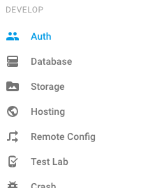

# Welcome to our Authentication workshop!


Today we are going to implement a webpage that a user has to sign into to access. Like a lot of webpages, we can use google or facebook accounts for authentication. Let's start with facebook.

# First things first

You need to fork and clone this repo duhhhhh! Go ahead, you got this.


# Facebook Authentication


Well whattya know, there's a handy dandy npm module for implementing the facebook login with react. Let's intall it! (Note: do we need to do npm install?)

```
$ npm install react react-dom react-facebook-login —save
```


Ok ok I'll take a break from the memes for a bit while we get this set up :)

Let’s start with our app file. Currently you can see we have a basic structure there.

```
import React, { Component } from 'react';

// example class based component (smart component)
class App extends Component {
  constructor(props) {
    super(props);

    this.state = {

    };

  }


  render() {
    return (
      <div id="login">
      </div>
    );
  }
}

export default App;

```

Now we need to import our react Facebook login at the top of our file.

```
import FacebookLogin from 'react-facebook-login';
```

What are we going to render? A login button right? Ok so here is the basic structure of the Facebook login element based off of the NPM documentation for that module. You want to put this inside the current login div.

```
  <FacebookLogin
    appId=“yourapiid"
    autoLoad
    fields="name,email,picture"
    callback={someCallback} 
/>
```

So it looks like we need an API ID. 

Head over here to get your ID. (Note: need more specific instructions on this)

Now add it into the code where we specified. What else do we need to do? We need to define our callback function, or what the website will return after the user is logged in. Facebook’s api is nice because it allows you to access some user information, so let’s use that to welcome the user when they log in!

First step is to name our login function. You can call it whatever you want, but we gave it the creative title onFacebookLogin. So inside the callback curly braces add the function name.

```
callback={this.onFacebookLogin}
```

We also want to set the scope as “user_birthday”???????

```
scope="user_birthday"
```

Then, bind the login to this in your constructor (you should know how to do this by now) and create your function.

```
onFacebookLogin(response) {
  if (response.status !== ‘not_authorized’ && response.status !== ‘unknown’){

  } else {

  }
}
```

Here we already have a nice if-statement that checks whether the login was successful or not yay!

Now inside we want to greet the user. So we want to add to our html when logged in. Here’s an example of what you could say!

```
      document.getElementById('login').innerHTML = `Welcome, ${response.name}! `;
      document.getElementById('login').innerHTML += `Your email is <span class="email">${response.email}</span>.`;
      document.getElementById('login').innerHTML += ``;
      document.getElementById('login').style = 'display: block’;
```

And if they weren’t logged in you would just keep the html the same, maybe keeping it as a block??? AKA put this in the else statement.

```
document.getElementById('login').style = 'display: block';
```

The picture seems kinda small too so let’s change the fields attribute in our Facebook element to:

```
fields="name,email,picture.type(large)”
```

There we go! Ok now we are ready to test it out! Try logging it and see what happens. Make sure to ask questions if you are having trouble, or retrace your steps in the tutorial.

Ok lets switch gears and add a google login for kicks as well!


# Google Authentication:

## Step one: Get the Client ID

We'll be being implementing a Google log-in feature into a React component using a node-modeule.
But so before we start, we need to go create a Google Developers Console project and client ID.

_Instructions gathered from (https://developers.google.com/identity/sign-in/web/devconsole-project) and (https://developers.google.com/identity/sign-in/web/sign-in)._

First go to:
[google's API console](https://console.developers.google.com/project/_/apiui/apis/library)

and create a new project.

In the sidebar under "API Manager", select Credentials, then select the OAuth consent screen tab.
Choose an Email Address, specify a Product Name, and press Save.

In the Credentials tab, select the New credentials drop-down list, and choose OAuth client ID.

Under Application type, select Web application.
Register the origins from which your app is allowed to access the Google APIs, as follows. An origin is a unique combination of protocol, hostname, and port.
In the Authorized JavaScript origins field, enter the origin for your app. You can enter multiple origins to allow for your app to run on different protocols, domains, or subdomains. You cannot use wildcards. In the example below, the second URL could be a production URL.

http://localhost:8080
https://myproductionurl.example.com

The Authorized redirect URI field does not require a value. Redirect URIs are not used with JavaScript APIs.

Press the Create button.

From the resulting OAuth client dialog box, copy the Client ID, you will use it soon!! The Client ID lets your app access enabled Google APIs.


Ok now we can add google sign in to our website! Yay!


## Step two: An Introduction to Google API JavaScript Client and Installing the Node-Module

To streamline accessing the client we'll be using the node-module react-google-client. You can find more information about it [here](https://github.com/anthonyjgrove/react-google-login). Install it with npm like you normally do:

```
npm install --save react-google-login
```

This module provides the code for a google login React component, SWEET!
We'll be adding the component into App so don't forget to import it:
```
import GoogleLogin from 'react-google-login';
```

## Step three: Add In Callback Function and Sign-In Button

After we set up the callback function, we can add in the component in render() like we normally do in React:
```
<GoogleLogin
  clientId="YOUR-CLIENT-ID"
  buttonText="BUTTON-TEXT"
  callback={this.onGoogleLogin}
/>
```

Now we have a functioning login/logout feature to our react app! WOO!


Now we want to make our app do something with this login info!

blah

Sweet we are done!


# Firebase Authentication
Firebase provides users with an easy to use, pre-styled auth solution that also allows developers to manage their users. This portion of the workshop will show you how to incorporate firebase authentication in a React component.
We'll be working with firebase in a `firebaseui.js` file. Functions from this file are exported and used in the React component file `firebaseApp.js` that is called in the `app.js` file.
Information for this workshop is based off the Firebase's [documentation](https://firebase.google.com/docs/auth/)

## Initializing Firebase and FirebaseUI
Start by creating a firebase project like you did in HW3 in the [firebase console](https://console.developers.google.com/apis).

Don't forget to install firebase:
```
npm install --save firebase
```

To use firebase for authentication you need to first initialize firebase and then initialize FirebaseUI.

Grab the configs and `initializeApp` line and put them in the top of the `firebaseui.js` file. Like in HW3 this file will contain our functions that access firebase.

Initialize FirebaseUI by placing this line in `firebase.js`:
```
var ui = new firebaseui.auth.AuthUI(firebase.auth());
```
And then add the following two lines to your `<head>` in `index.html`:
```
<script src="https://www.gstatic.com/firebasejs/ui/live/0.4/firebase-ui-auth.js"></script>
<link type="text/css" rel="stylesheet" href="https://www.gstatic.com/firebasejs/ui/live/0.4/firebase-ui-auth.css" />
```
This will make your sign-in buttons look sweet.

## Set up Firebase Authnetication

Let's set up the authentication in the console next! Go back to your [firebase console](https://console.developers.google.com/apis) and click on the Authentication tab.


The click on Sign-In Method and enable the one's you feel appropriate. Since Firebase is a Google product, enabling users to sign on via Google may be helpful.  


## Prompt for Sign In

Scan through `firebaseui.js`. In this particular project the start function prompts the widget to ask the user to sign in and passes along user information to a callback function if the sign in is successful. The widget requires a number of configs as well. Adapt and insert the following code under the `start()`.
```
// FirebaseUI config.
var uiConfig = {
//  'signInSuccessUrl': '', // Provides a redirect URL after signing in
  'signInOptions': [
    // Leave the lines as is for the providers you want to offer your users.
    // Make sure to enable them on your console
    firebase.auth.GoogleAuthProvider.PROVIDER_ID,
    firebase.auth.FacebookAuthProvider.PROVIDER_ID,
    firebase.auth.TwitterAuthProvider.PROVIDER_ID,
    firebase.auth.GithubAuthProvider.PROVIDER_ID,
    firebase.auth.EmailAuthProvider.PROVIDER_ID,
  ],
  'callbacks': {
    'signInSuccess': (currentUser) => {
      callback(currentUser);
      return false;
    },
  },
};
```
You can find more information about the configuration parameters [here](https://github.com/firebase/FirebaseUI-Web)

To make the sign-in widget appear place the following line after the configs:
```
// The start method will wait until the DOM is loaded.
// Acts on the <div id="firebaseui-auth-container" /> tag
ui.start('#firebaseui-auth-container', uiConfig);
```
Now when you call the start function sign-in buttons will appear and prompt the user to sign in.
Check out the `getUser` function. This retrieves a reference to the user object after a user has been authenticated to retrieve additional information about a user.

Notice how the ui.start method has a `#firebaseui-auth-container`? This indicates that the widget will appear onto something with that id such as: `<div id="firebaseui-auth-container" />`.
Place this line in `firebaseApp.js` within `return()`.

Running `npm start` should now prompt you with a fun sign-in widget and display some information about the signed in user.

NOTE: We recommend opening `localhost:8080` in an incognito window to avoid multiple signed in accounts causing problems.
